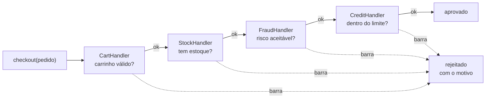

# Chain of Responsibility

O Chain of Responsibility passa um pedido por uma **fila de handlers**, e cada um decide entre tratar e repassar. O remetente não sabe quem vai responder, e nenhum handler conhece os outros.

---

## Como funciona



As setas sólidas são o caminho feliz e as pontilhadas são as saídas antecipadas — **qualquer elo pode encerrar a cadeia**. É por isso que a ordem importa: as checagens baratas (carrinho, estoque) vêm antes das caras (antifraude, crédito), e um carrinho vazio nunca chega a consultar o banco.

| Parte | Responsabilidade |
|---|---|
| **Handler base** (`CheckoutHandler`) | Guarda o próximo da fila, repassa e oferece o `reject` |
| **Handlers concretos** (`CartHandler`, `StockHandler`, `FraudHandler`, `CreditHandler`) | Cada um checa uma coisa e decide entre barrar e chamar `super.handle()` |
| **Cliente** (`index.ts`) | Monta a cadeia e chama só o primeiro elo |

---

## Como usar

```typescript
import { CartHandler } from './CartHandler';
import { StockHandler } from './StockHandler';
import { FraudHandler } from './FraudHandler';
import { CreditHandler } from './CreditHandler';

const chain = new CartHandler();
chain.setNext(new StockHandler()).setNext(new FraudHandler()).setNext(new CreditHandler());

chain.handle(pedido); // { approved: false, by: 'FraudHandler', reason: 'risco 95 acima…' }
```

O `setNext` devolve o handler recebido, e é isso que permite encadear numa linha só. Tirar o antifraude da política é apagar um `setNext` — nenhuma classe muda.

---

## Benefícios

- **Cada checagem isolada** — uma classe por regra, testável sozinha
- **A ordem vira configuração** — reordenar, remover ou acrescentar um elo não toca no código dos outros
- **Quem chama não conhece a política** — o cliente fala com o primeiro elo e recebe uma resposta

## Malefícios

- **Sem garantia de resposta** — se ninguém tratar, o pedido chega ao fim da fila em silêncio; aqui o último elo sempre decide, de propósito
- **Difícil de depurar** — o caminho só existe em runtime, e um elo mal posicionado passa despercebido
- **Ordem implícita** — a política fica no encadeamento, não numa lista declarada

---

## Quando usar

| Use Chain of Responsibility | Não use |
|---|---|
| Várias checagens independentes sobre o mesmo pedido | Existe uma regra só |
| A ordem e o conjunto de regras mudam | O fluxo é fixo e curto |
| Quem chama não deve conhecer as regras | O próprio chamador decide o que validar |

---

## Chain of Responsibility x Decorator

Os dois montam uma corrente de objetos que se repassam a chamada. O [Decorator](../../structural/decorator/) sempre repassa e **acrescenta comportamento** no caminho; aqui cada elo pode **interromper** e responder sozinho. Um enriquece, o outro decide.

---

## Estrutura dos arquivos

```
behavioral/chain-of-responsibility/src/
  ICheckoutHandler.ts       ← contrato do elo (setNext e handle)
  CheckoutHandler.ts        ← elo base (guarda o próximo, repassa, rejeita)
  CartHandler.ts            ← checa o carrinho
  StockHandler.ts           ← checa o estoque
  FraudHandler.ts           ← checa o risco
  CreditHandler.ts          ← checa o limite e aprova
  index.ts                  ← exemplo de uso (quatro pedidos, quatro desfechos)
  CheckoutHandler.test.ts   ← checagem de que o primeiro que barra interrompe
```

---

## Referência

[Refactoring Guru — Chain of Responsibility](https://refactoring.guru/pt-br/design-patterns/chain-of-responsibility)
