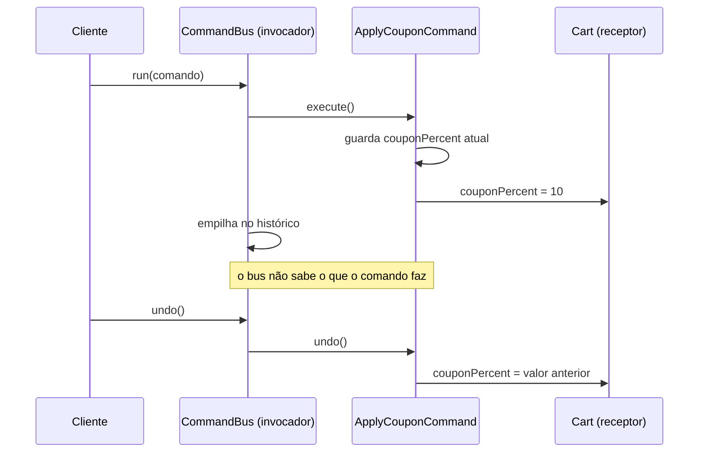

# Command

O Command transforma uma operação em **objeto**. Em vez de chamar o método direto, você cria um objeto que sabe se executar — e, por isso, também consegue ser guardado, enfileirado e desfeito.

---

## Como funciona



O passo em que o comando **guarda o estado anterior antes de agir** é o que torna o undo possível — sem ele, o `undo()` teria que adivinhar para onde voltar. E a nota marca o outro ponto: o `CommandBus` empilha e desempilha objetos sem saber se são cupom, item ou qualquer outra coisa.

| Parte | Responsabilidade |
|---|---|
| **Comando** (`ICommand`) | Contrato: `execute`, `undo` e um rótulo legível |
| **Comandos concretos** (`AddItemCommand`, `RemoveItemCommand`, `ApplyCouponCommand`) | Cada um sabe fazer e desfazer a sua operação |
| **Receptor** (`Cart`) | Faz o trabalho de verdade; não sabe que comandos existem |
| **Invocador** (`CommandBus`) | Dispara comandos e mantém o histórico para o undo |

---

## Como usar

```typescript
import { Cart } from './Cart';
import { CommandBus } from './CommandBus';
import { AddItemCommand } from './AddItemCommand';
import { ApplyCouponCommand } from './ApplyCouponCommand';

const cart = new Cart();
const bus = new CommandBus();

bus.run(new AddItemCommand(cart, { sku: 'livro-ddd', name: 'Livro DDD', quantity: 2, unitPriceInCents: 12900 }));
bus.run(new ApplyCouponCommand(cart, 10));

bus.undo(); // tira o cupom, voltando ao desconto que havia antes
```

---

## Benefícios

- **Undo/redo de graça** — o histórico é só uma pilha de comandos
- **Operações viram dados** — dá para enfileirar, agendar, repetir ou registrar em log
- **Desacopla quem pede de quem faz** — um botão, um atalho e um job podem disparar o mesmo comando

## Malefícios

- **Uma classe por operação** — o número de arquivos cresce rápido
- **Undo correto dá trabalho** — cada comando precisa guardar o suficiente para voltar, e operações com efeito externo (e-mail enviado) simplesmente não desfazem
- **Indireção** — ler o fluxo exige abrir o comando, não a chamada

---

## Quando usar

| Use Command | Não use Command |
|---|---|
| Precisa de desfazer, refazer, fila ou log de ações | A ação é uma chamada direta e irreversível |
| A mesma ação é disparada de vários lugares | Só existe um gatilho |
| As ações precisam ser parametrizadas ou agendadas | O trabalho acontece na hora, sempre igual |

---

## Command x Memento

Os dois servem ao Ctrl+Z, por caminhos opostos. O Command guarda **a operação** e sabe aplicar o inverso dela; o [Memento](../memento/) guarda **o estado inteiro** e volta a ele. Comandos ocupam menos memória e dão log e fila; mementos são mais simples quando a operação é difícil de inverter. Dá para combinar: um comando cujo `undo` restaura um memento.

---

## Estrutura dos arquivos

```
behavioral/command/src/
  ICommand.ts             ← contrato (execute, undo, label)
  Cart.ts                 ← receptor (faz o trabalho de verdade)
  AddItemCommand.ts       ← comando (adicionar item)
  RemoveItemCommand.ts    ← comando (remover, guardando o que saiu)
  ApplyCouponCommand.ts   ← comando (cupom, guardando o anterior)
  CommandBus.ts           ← invocador (dispara e mantém o histórico)
  index.ts                ← exemplo de uso (quatro comandos e dois undo)
  CommandBus.test.ts      ← checagem do undo em ordem inversa
```

---

## Referência

[Refactoring Guru — Command](https://refactoring.guru/pt-br/design-patterns/command)
