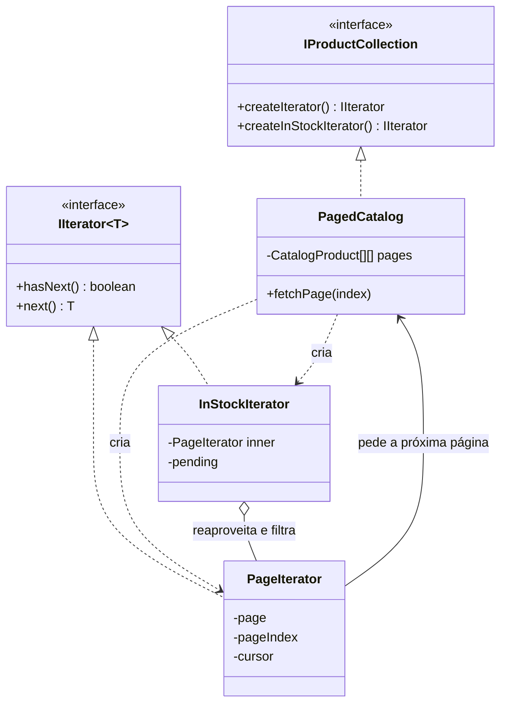

# Iterator

O Iterator percorre uma coleção **sem expor como ela é guardada por dentro**. Quem caminha só conhece `hasNext` e `next`; se o que está atrás é um array, uma árvore ou uma API paginada, não faz diferença.

---

## Como funciona



Repare que a posição do percurso (`pageIndex`, `cursor`) mora no **iterador**, não na coleção. É isso que permite dois percursos simultâneos sobre o mesmo catálogo sem um atrapalhar o outro — e é por isso que a coleção, sozinha, não tem um "próximo".

| Parte | Responsabilidade |
|---|---|
| **Iterador** (`IIterator<T>`) | Contrato do percurso: `hasNext` e `next` |
| **Iteradores concretos** (`PageIterator`, `InStockIterator`) | Cada um caminha de um jeito e guarda a própria posição |
| **Coleção** (`IProductCollection`) | Sabe criar iteradores para si mesma |
| **Coleção concreta** (`PagedCatalog`) | Guarda os produtos em páginas — detalhe que ninguém de fora vê |

---

## Como usar

```typescript
const catalog = new PagedCatalog(produtos);

const todos = catalog.createIterator();
while (todos.hasNext()) console.log(todos.next().name);

const disponiveis = catalog.createInStockIterator(); // outro caminho, mesma coleção
```

A busca é preguiçosa: ler dois produtos carrega uma página só. Quem consome nunca soube que existe paginação.

---

## Iterator no JavaScript

A linguagem já traz o padrão embutido. Implementar `[Symbol.iterator]` faz a coleção funcionar em `for...of`, no spread e na desestruturação:

```typescript
*[Symbol.iterator]() {
  const iterator = this.createIterator();
  while (iterator.hasNext()) yield iterator.next();
}

for (const product of catalog) console.log(product.name);
const todos = [...catalog];
```

Na prática, em TypeScript, **é esta a forma que você deve escrever**. A interface `IIterator` está aqui para mostrar a mecânica do padrão; o protocolo nativo é a mesma ideia com sintaxe melhor e integração com a linguagem.

---

## Benefícios

- **Esconde a estrutura** — paginação, árvore ou lista ligada ficam invisíveis para quem percorre
- **Vários percursos** — ordem natural, filtrado, invertido, cada um numa classe
- **Percursos simultâneos** — cada iterador tem a própria posição
- **Preguiçoso** — dá para parar no meio sem ter carregado o resto

## Malefícios

- **Exagero em coleção simples** — para um array, `for...of` já resolve
- **Invalidação** — se a coleção muda durante o percurso, o iterador pode ficar inconsistente
- **Mais classes** — cada forma de caminhar é um arquivo

---

## Quando usar

| Use Iterator | Não use Iterator |
|---|---|
| A estrutura interna é complexa ou cara de percorrer | É um array e você quer só um `for` |
| Existem várias formas de percorrer a mesma coleção | Existe uma ordem só, óbvia |
| O consumo deve ser preguiçoso ou parcial | A coleção inteira já está na memória e é pequena |

---

## Iterator x Composite

O [Composite](../../structural/composite/) monta a estrutura em árvore; o Iterator define **como caminhar** por ela. Combinam bem: um iterador em profundidade e outro em largura percorrem a mesma árvore sem que ela precise saber de nenhum dos dois.

---

## Estrutura dos arquivos

```
behavioral/iterator/src/
  CatalogProduct.ts     ← o item percorrido
  IIterator.ts          ← contratos (iterador e coleção)
  PagedCatalog.ts       ← coleção concreta (guarda em páginas) + Symbol.iterator
  PageIterator.ts       ← percurso completo, buscando página sob demanda
  InStockIterator.ts    ← percurso filtrado, sobre a mesma coleção
  index.ts              ← exemplo de uso (três percursos)
  PageIterator.test.ts  ← checagem da posição própria e da busca preguiçosa
```

---

## Referência

[Refactoring Guru — Iterator](https://refactoring.guru/pt-br/design-patterns/iterator)
