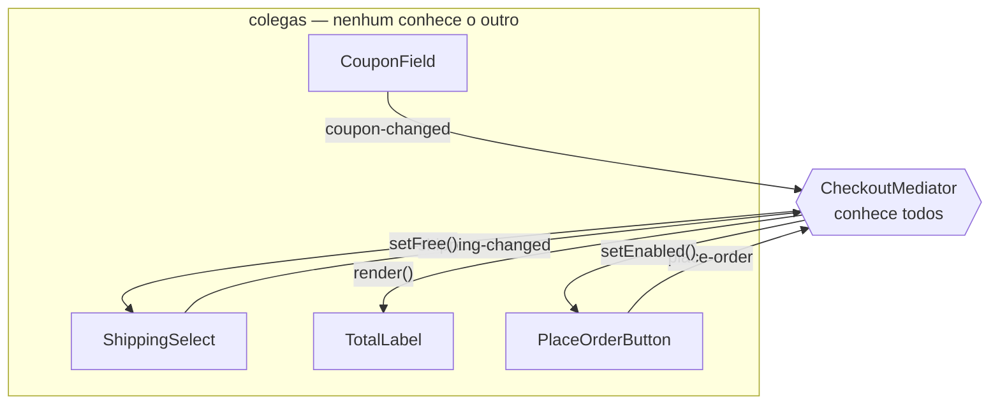

# Mediator

O Mediator tira a conversa direta entre objetos e coloca **um intermediário no meio**. Cada colega conhece só o mediador; a regra de "quando isto muda, aquilo reage" passa a existir em um lugar só.

---

## Como funciona



Todas as setas passam pelo meio: **não existe uma ligando um colega ao outro**. Sem o mediador, o `CouponField` precisaria importar o frete, o total e o botão para avisar os três — e cada componente novo aumentaria esse emaranhado. É por isso que um cupom de frete grátis consegue zerar o frete sem que o campo de cupom saiba que frete existe.

| Parte | Responsabilidade |
|---|---|
| **Mediador** (`IMediator`) | Contrato: `notify(sender, event)` |
| **Mediador concreto** (`CheckoutMediator`) | Guarda todos os colegas e concentra as regras de reação |
| **Colega base** (`FormComponent`) | Guarda o mediador e sabe avisá-lo |
| **Colegas** (`CouponField`, `ShippingSelect`, `TotalLabel`, `PlaceOrderButton`) | Cuidam do próprio estado e avisam quando algo muda |

---

## Como usar

```typescript
const form = new CheckoutMediator(
  25800,
  new CouponField(),
  new ShippingSelect(),
  new TotalLabel(),
  new PlaceOrderButton(),
);

form.coupon.type('FRETEGRATIS'); // zera o frete, recalcula o total
form.coupon.type('NAOEXISTE');   // desabilita o botão com o motivo
```

---

## Benefícios

- **Colegas independentes** — nenhum componente importa outro, e cada um é testável sozinho
- **A regra fica visível** — o "quando X, então Y" mora num arquivo, não espalhado em callbacks
- **Reutilização** — o mesmo `CouponField` serve a outro formulário com outro mediador

## Malefícios

- **O mediador engorda** — ele concentra a complexidade que estava distribuída e vira um *god object* se ninguém cuidar
- **Indireção** — seguir o fluxo exige passar pelo meio a cada salto
- **Exagero para poucos colegas** — com dois componentes, uma chamada direta é mais honesta

---

## Quando usar

| Use Mediator | Não use Mediator |
|---|---|
| Muitos objetos se afetam em várias direções | A comunicação é de mão única |
| A teia de dependências trava mudanças | São dois ou três objetos com relação estável |
| A regra de interação muda por contexto | A regra é fixa e pertence claramente a um dos lados |

---

## Mediator x Observer

O [Observer](../observer/) é uma transmissão: o sujeito avisa quem se inscreveu e **não espera reação coordenada** — os observers não se relacionam. O Mediator é uma central: ele recebe o aviso e **decide o que cada colega faz em seguida**, inclusive na ordem certa. Observer desacopla um-para-muitos; Mediator organiza muitos-para-muitos.

## Mediator x Facade

Os dois põem um objeto na frente de vários outros. A [Facade](../../structural/facade/) oferece uma entrada simples para um subsistema e o tráfego é de mão única — os subsistemas não sabem que ela existe. No Mediator a conversa é de mão dupla: os colegas avisam o mediador, e ele responde agindo sobre eles.

---

## Estrutura dos arquivos

```
behavioral/mediator/src/
  IMediator.ts              ← contrato do mediador (notify)
  FormComponent.ts          ← colega base (guarda o mediador e avisa)
  CouponField.ts            ← colega (cupom e validação)
  ShippingSelect.ts         ← colega (frete, com modo grátis)
  TotalLabel.ts             ← colega passivo (só mostra)
  PlaceOrderButton.ts       ← colega (habilitado/desabilitado)
  CheckoutMediator.ts       ← mediador concreto (todas as regras de reação)
  index.ts                  ← exemplo de uso (cupons, frete e o clique)
  CheckoutMediator.test.ts  ← checagem das reações em cadeia
```

---

## Referência

[Refactoring Guru — Mediator](https://refactoring.guru/pt-br/design-patterns/mediator)
