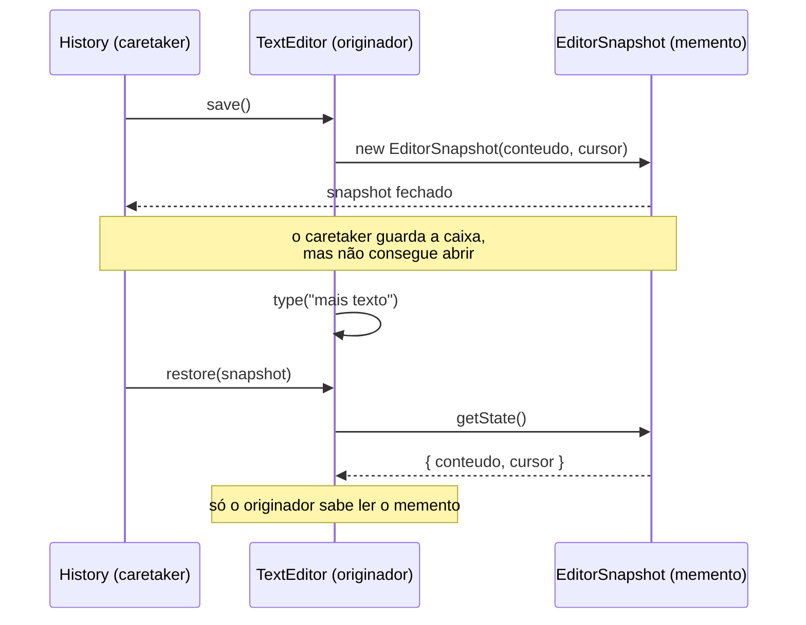

# Memento

O Memento é um padrão comportamental que permite salvar e restaurar o estado de um objeto sem expor como esse estado é guardado por dentro. É o padrão por trás de qualquer `Ctrl+Z`.

---

## Como funciona



As duas notas são o padrão inteiro. O `History` empilha e devolve snapshots sem nunca ler o que tem dentro — ele não sabe que existe um cursor, e por isso mudar o estado interno do editor não quebra o histórico. E como só o `TextEditor` chama `getState`, o encapsulamento sobrevive ao undo.

| Parte | Responsabilidade |
|---|---|
| **Originador** (`TextEditor`) | Dono do estado; sabe tirar o snapshot (`save`) e voltar para ele (`restore`) |
| **Memento** (`EditorSnapshot`) | Pacote fechado com o estado salvo — ninguém de fora lê nem altera |
| **Caretaker** (`History`) | Guarda a pilha de snapshots e decide *quando* desfazer, sem olhar o conteúdo |
| **Cliente** (`index.ts`) | Edita o texto e pede `backup()` / `undo()` |

---

## Como usar

```typescript
import { TextEditor } from './TextEditor';
import { History } from './History';

const editor = new TextEditor();
const history = new History(editor);

history.backup();          // salva antes de mexer
editor.type('Padrões de projeto');

history.undo();            // volta ao estado anterior
```

---

## O ponto do padrão

`content` e `cursor` são `private` no `TextEditor` — e continuam privados. O `History` segura os snapshots a conversa toda **sem nunca conseguir ler o texto**. É isso que separa o Memento de simplesmente jogar o estado num objeto público: o histórico ganha o poder de desfazer sem ganhar o poder de bisbilhotar ou corromper.

---

## Benefícios

- **Undo sem quebrar encapsulamento** — o estado interno não vaza para quem só precisa guardá-lo
- **Responsabilidade separada** — o editor cuida do texto, o histórico cuida da pilha
- **Fácil de estender** — redo, autosave ou checkpoint são variações do mesmo caretaker

## Malefícios

- **Custo de memória** — cada snapshot é uma cópia do estado; por isso o `History` tem um limite
- **Snapshot caro** — em objetos grandes, copiar tudo a cada edição pesa (a alternativa é guardar o *diff*, que é o padrão [Command](https://refactoring.guru/pt-br/design-patterns/command))
- **Ciclo de vida** — alguém precisa decidir quando descartar snapshots antigos

---

## Quando usar

| Use Memento | Não use Memento |
|---|---|
| Precisa de undo, redo, rascunho ou checkpoint | O estado é trivial de recalcular |
| O estado é privado e não deve vazar | O objeto já é imutável (basta guardar a referência antiga) |
| Uma operação pode precisar ser revertida | Cada snapshot custa caro demais em memória |

---

## Memento x Facade

A [Facade](../../structural/facade/) desfaz um fluxo chamando as operações inversas (`refund`, `release`) — compensação passo a passo, porque cobrança e estoque vivem em serviços externos. O Memento desfaz **restaurando o estado inteiro de uma vez**, o que só funciona quando o estado está todo dentro do objeto.

---

## Estrutura dos arquivos

```
behavioral/memento/src/
  TextEditor.ts      ← originador (dono do estado, save/restore)
  EditorSnapshot.ts  ← memento (estado salvo, fechado para o caretaker)
  History.ts         ← caretaker (pilha de snapshots, backup/undo)
  index.ts           ← exemplo de uso (digitar, corrigir, desfazer)
  History.test.ts    ← checagem do undo, do histórico vazio e do limite
```

---

## Referência

[Refactoring Guru — Memento](https://refactoring.guru/pt-br/design-patterns/memento)
