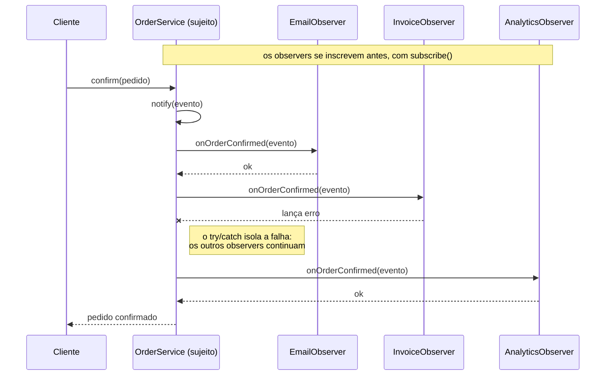

# Observer

O Observer é um padrão comportamental que define um mecanismo de assinatura: um objeto (o sujeito) avisa vários outros (os observers) quando algo acontece, sem saber quem são nem o que fazem. É a base de `EventEmitter`, `addEventListener`, webhooks e RxJS.

---

## Como funciona



A leitura importante é a da terceira coluna em diante: o `OrderService` dispara a mesma mensagem para cada inscrito sem saber o que eles fazem nem quantos são. A linha cortada mostra por que o `notify` envolve cada chamada em `try/catch` — um observer quebrado não pode derrubar o pedido nem impedir os que vêm depois.

| Parte | Responsabilidade |
|---|---|
| **Interface** (`IOrderObserver`) | Contrato de quem quer ser avisado: `onOrderConfirmed(evento)` |
| **Sujeito** (`OrderService`) | Mantém a lista de inscritos (`subscribe` / `unsubscribe`) e dispara o evento |
| **Observers concretos** (`EmailObserver`, `InvoiceObserver`, `AnalyticsObserver`) | Cada um reage do seu jeito ao mesmo evento |
| **Cliente** (`index.ts`) | Monta as inscrições e confirma o pedido |

---

## Como usar

```typescript
import { OrderService } from './OrderService';
import { EmailObserver } from './EmailObserver';

const orders = new OrderService();
orders.subscribe(new EmailObserver());

orders.confirm({ orderId: 'ped-001', customerId: 'cliente-42', amountInCents: 12900 });
```

Adicionar antifraude, cashback ou integração com ERP é criar um observer e inscrevê-lo — o `confirm()` não muda.

---

## Um detalhe que importa

Um observer que estoura não pode derrubar o pedido nem os observers seguintes. Por isso o `notify` isola cada chamada em `try/catch`: a compra já aconteceu, falha no e-mail não pode desfazê-la.

---

## Benefícios

- **Aberto/fechado** — novo efeito colateral = nova classe, sem tocar no sujeito
- **Desacoplamento** — o `OrderService` não importa nem conhece nenhum observer
- **Inscrição em runtime** — dá para ligar e desligar reações conforme a configuração do cliente

## Malefícios

- **Ordem imprevisível** — se um observer depende de outro ter rodado antes, o padrão é o errado (use uma [facade](../../structural/facade/))
- **Difícil de depurar** — o fluxo some do código; para saber o que acontece é preciso descobrir quem se inscreveu
- **Vazamento de memória** — observer que nunca faz `unsubscribe` mantém o objeto vivo

---

## Quando usar

| Use Observer | Não use Observer |
|---|---|
| Um evento dispara vários efeitos independentes | O passo seguinte depende do resultado do anterior |
| A lista de interessados muda em runtime | Existe um único interessado, fixo |
| Você quer adicionar reações sem editar quem dispara | A ordem de execução é parte da regra de negócio |

---

## Observer x Facade

A [Facade](../../structural/facade/) chama os serviços **na mão, na ordem certa, e desfaz quando algo falha** — é um fluxo com dependência entre passos. O Observer só **anuncia** que algo aconteceu: os inscritos são independentes entre si e ninguém garante ordem. Cobrança e envio pedem facade; e-mail e analytics pedem observer.

---

## Estrutura dos arquivos

```
behavioral/observer/src/
  IOrderObserver.ts     ← interface + formato do evento
  OrderService.ts       ← sujeito (subscribe / unsubscribe / notify)
  EmailObserver.ts      ← observer concreto (confirmação por e-mail)
  InvoiceObserver.ts    ← observer concreto (nota fiscal)
  AnalyticsObserver.ts  ← observer concreto (métricas)
  index.ts              ← exemplo de uso (inscrição, evento e unsubscribe)
  OrderService.test.ts  ← checagem da notificação e do isolamento de falhas
```

---

## Referência

[Refactoring Guru — Observer](https://refactoring.guru/pt-br/design-patterns/observer)
