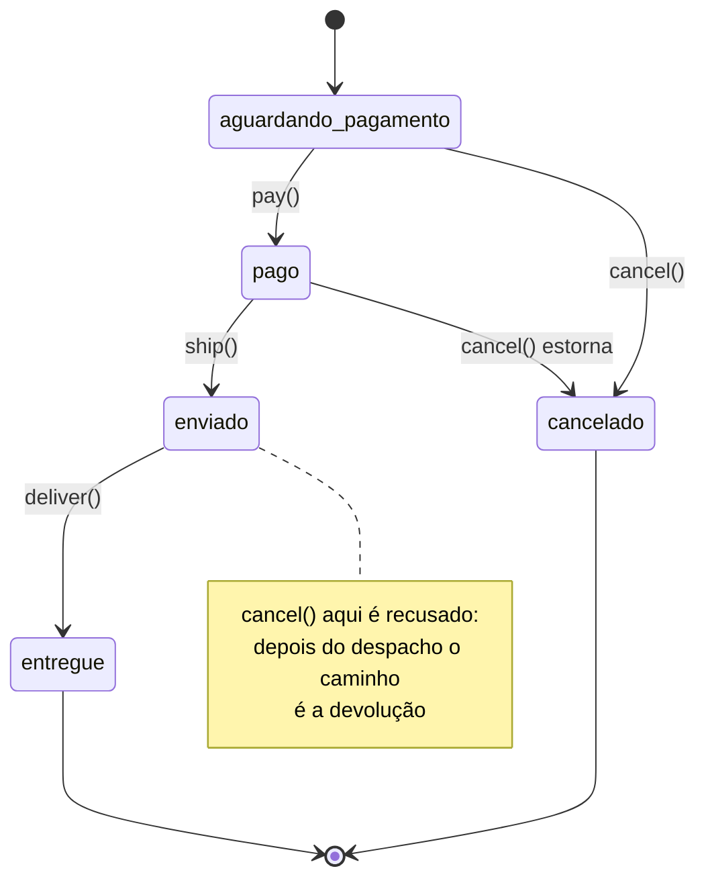

# State

O State deixa um objeto **mudar de comportamento quando o estado interno muda**, como se ele trocasse de classe. Cada estado vira um objeto que sabe o que é permitido enquanto ele estiver no comando.

---

## Como funciona



O diagrama é o código: **cada seta é um método que aquele estado libera**, e tudo que não tem seta é recusado pela classe base. É por isso que não existe um `switch (order.status)` em lugar nenhum — quem decide o que pode acontecer é o objeto do estado atual.

| Parte | Responsabilidade |
|---|---|
| **Contexto** (`Order`) | Guarda o estado atual, delega tudo a ele e expõe `transitionTo` |
| **Estado base** (`OrderState`) | Recusa todas as ações por padrão |
| **Estados concretos** (`PendingPaymentState`, `PaidState`, `ShippedState`, `DeliveredState`, `CancelledState`) | Cada um libera só o que faz sentido e escolhe o próximo estado |

A recusa por padrão é a decisão de projeto mais importante aqui: uma transição nova nunca fica permitida por esquecimento.

---

## Como usar

```typescript
const order = new Order('ord-901');

order.pay();      // aguardando pagamento → pago
order.ship();     // pago → enviado
order.cancel();   // recusado: o pedido está enviado
order.deliver();  // enviado → entregue
```

---

## Benefícios

- **Sem condicional gigante** — some o `switch (status)` que ia crescendo a cada regra
- **Cada estado isolado** — uma classe por estado, testável sozinha
- **Transições explícitas** — ler `PaidState` é ler exatamente o que dá para fazer depois de pagar

## Malefícios

- **Muitas classes** — para dois estados estáveis, um booleano resolve
- **Estados se conhecem** — `PendingPaymentState` importa `PaidState`, então o grafo de transições vira acoplamento entre as classes
- **Estado espalhado** — entender o ciclo de vida exige abrir vários arquivos (o diagrama acima existe por isso)

---

## Quando usar

| Use State | Não use State |
|---|---|
| O objeto tem um ciclo de vida com várias fases | São dois estados e nada muda de comportamento |
| O mesmo método faz coisas diferentes conforme a fase | O comportamento é sempre igual |
| O `switch` sobre status aparece em vários lugares | A checagem existe num ponto só e é trivial |

---

## State x Strategy

A estrutura é a mesma: um contexto que delega para um objeto trocável. A diferença está em **quem troca e se os objetos se conhecem**. Na [Strategy](../strategy/), quem escolhe é o cliente, e as strategies se ignoram — são alternativas independentes para a mesma tarefa. No State, quem troca é o próprio estado, e eles se conhecem o suficiente para formar um grafo de transições. Strategy é "de que jeito fazer"; State é "em que fase estou".

---

## Estrutura dos arquivos

```
behavioral/state/src/
  IOrderState.ts           ← contrato do estado
  OrderState.ts            ← base que recusa tudo por padrão
  Order.ts                 ← contexto (guarda o estado e delega)
  PendingPaymentState.ts   ← libera pay e cancel
  PaidState.ts             ← libera ship e cancel (com estorno)
  ShippedState.ts          ← libera só deliver
  DeliveredState.ts        ← estado final
  CancelledState.ts        ← estado final
  index.ts                 ← exemplo de uso (caminho feliz e recusas)
  Order.test.ts            ← checagem das transições permitidas
```

---

## Referência

[Refactoring Guru — State](https://refactoring.guru/pt-br/design-patterns/state)
