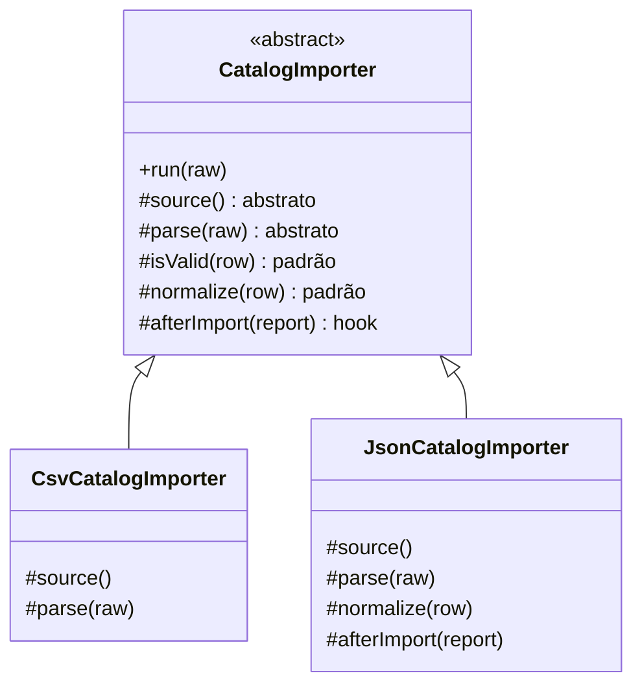

# Template Method

O Template Method põe **o esqueleto do algoritmo na superclasse** e deixa as subclasses preencherem os passos. A sequência é fixa; o conteúdo de cada etapa é que varia.

---

## Como funciona



O único método público é o `run`, e ele **não é sobrescrito por ninguém** — é ele que chama `parse`, `isValid`, `normalize` e `afterImport` sempre nessa ordem. Compare as duas subclasses: a de CSV preenche só o mínimo obrigatório, enquanto a de JSON também troca a normalização (o preço já vem em centavos) e usa o hook do fim. Nenhuma das duas consegue mudar a sequência.

| Tipo de passo | Exemplo | O que significa |
|---|---|---|
| **Abstrato** | `parse`, `source` | A subclasse é obrigada a implementar |
| **Com padrão** | `isValid`, `normalize` | Já funciona; sobrescrever é opcional |
| **Hook** | `afterImport` | Vazio de propósito, para plugar algo no fim |

---

## Como usar

```typescript
class CsvCatalogImporter extends CatalogImporter {
  protected get source() { return 'CSV'; }

  protected parse(raw: string) {
    // só o que é específico do CSV
  }
}

new CsvCatalogImporter().run(conteudo); // { imported: 2, skipped: 2, products: [...] }
```

---

## Benefícios

- **A sequência existe num lugar só** — nenhuma subclasse esquece de validar antes de salvar
- **Duplicação some** — o que é igual fica na superclasse
- **Extensão controlada** — os pontos de variação são explícitos, e o resto é fechado

## Malefícios

- **Herança obriga** — a subclasse fica presa à superclasse, e só dá para herdar de uma
- **Inversão de controle** — quem lê a subclasse não vê quando os métodos são chamados; precisa abrir o template
- **Superclasse rígida** — mudar a sequência quebra todas as subclasses de uma vez
- **Vira esqueleto demais** — com muitos hooks, o template fica difícil de seguir

---

## Quando usar

| Use Template Method | Não use Template Method |
|---|---|
| Vários fluxos têm a mesma sequência e passos diferentes | Os fluxos têm sequências diferentes |
| A ordem dos passos precisa ser garantida | A ordem é escolha de quem chama |
| A variação é conhecida e estável | Os passos precisam ser combinados em runtime |

---

## Template Method x Strategy

Os dois trocam um pedaço de comportamento. O Template Method usa **herança**: a variação é escolhida na hora de escrever a classe, e a superclasse controla o fluxo. A [Strategy](../strategy/) usa **composição**: a variação é um objeto injetado, trocável em runtime. O Template Method varia partes de um algoritmo; a Strategy troca o algoritmo inteiro.

---

## Estrutura dos arquivos

```
behavioral/template-method/src/
  ImportedProduct.ts        ← tipos do produto e do relatório
  CatalogImporter.ts        ← superclasse com o template method run()
  CsvCatalogImporter.ts     ← implementa só os passos obrigatórios
  JsonCatalogImporter.ts    ← também sobrescreve normalize e usa o hook
  index.ts                  ← exemplo de uso (dois fornecedores)
  CatalogImporter.test.ts   ← checagem dos passos padrão, sobrescritos e do hook
```

---

## Referência

[Refactoring Guru — Template Method](https://refactoring.guru/pt-br/design-patterns/template-method)
