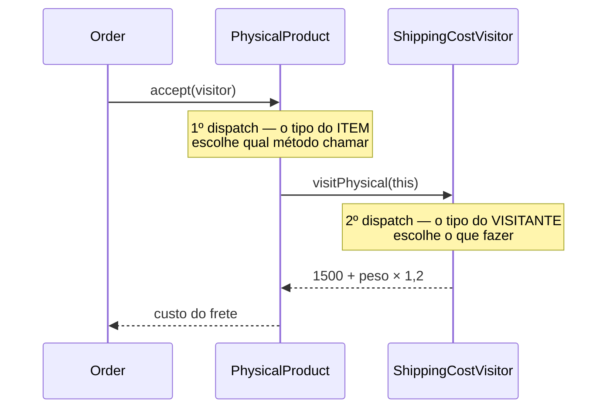

# Visitor

O Visitor separa **as operações** dos **objetos sobre os quais elas operam**. Cada algoritmo novo vira uma classe visitante; as classes visitadas não mudam nenhuma linha.

---

## Como funciona



Esses dois saltos são o **double dispatch**, o coração do padrão. Em linguagens sem sobrecarga por tipo em runtime, o `accept` existe só para isso: o item sabe qual dos métodos do visitante lhe corresponde, e o visitante sabe o que fazer. O resultado é que `PhysicalProduct` não precisa conhecer frete, imposto nem nota fiscal.

| Parte | Responsabilidade |
|---|---|
| **Visitante** (`IOrderItemVisitor<T>`) | Um método por tipo de item; `T` é o que a operação devolve |
| **Visitantes concretos** (`ShippingCostVisitor`, `TaxVisitor`, `InvoiceLineVisitor`) | Cada um é uma operação inteira sobre todos os tipos |
| **Elemento** (`IOrderItem`) | Só sabe se entregar ao método certo, via `accept` |
| **Elementos concretos** (`PhysicalProduct`, `DigitalProduct`, `GiftCard`) | Guardam os dados; nenhuma regra de negócio das operações |
| **Coleção** (`Order`) | Passa o visitante por cada item sem saber o que ele faz |

---

## Como usar

```typescript
const order = new Order([
  new PhysicalProduct('Livro DDD', 12900, 900),
  new DigitalProduct('Curso de TypeScript', 19900, 'https://loja.exemplo/curso'),
  new GiftCard('Vale-presente', 10000, 'amigo@exemplo.com'),
]);

order.total(new ShippingCostVisitor());   // digital e vale-presente não pagam frete
order.total(new TaxVisitor());            // cada tipo tem uma alíquota
order.accept(new InvoiceLineVisitor());   // devolve texto, não número
```

O `T` genérico é o que permite ao mesmo mecanismo devolver número num caso e texto no outro.

---

## O eixo que o Visitor escolhe

Esta é a decisão real por trás do padrão:

| Vai acontecer | Sem Visitor | Com Visitor |
|---|---|---|
| **Operação nova** (ex: peso total) | mexer em todos os tipos de item | uma classe nova, nada mais muda |
| **Tipo novo de item** (ex: assinatura) | uma classe nova, nada mais muda | mexer em **todos** os visitantes |

O Visitor troca a facilidade de acrescentar tipos pela de acrescentar operações. Escolha-o quando os tipos forem estáveis e as operações crescerem — o contrário disso é o que faz o padrão doer.

---

## Benefícios

- **Operação nova sem tocar nos tipos** — o princípio aberto/fechado no eixo das operações
- **Algoritmo inteiro num arquivo** — a regra de frete dos três tipos fica junta, e não espalhada por eles
- **Elementos limpos** — os itens guardam dados, não regras de imposto, frete e nota fiscal

## Malefícios

- **Tipo novo é caro** — cada visitante existente precisa de um método a mais
- **Quebra o encapsulamento** — o visitante precisa enxergar dados do item que talvez fossem privados
- **Verboso** — `accept` repetido em todo elemento, e uma interface que cresce com os tipos
- **Pouco idiomático em TypeScript** — uma união discriminada com `switch` resolve casos simples com muito menos cerimônia

---

## Quando usar

| Use Visitor | Não use Visitor |
|---|---|
| Os tipos são estáveis e as operações crescem | Novos tipos aparecem com frequência |
| A operação precisa de comportamento diferente por tipo | O comportamento é o mesmo para todos |
| Faz sentido manter o algoritmo inteiro num lugar só | A regra pertence naturalmente a cada objeto |

---

## Visitor x Composite

Combinam muito bem: o [Composite](../../structural/composite/) monta a árvore e o Visitor roda operações sobre ela, com o `accept` descendo pelos filhos. A árvore fica com a estrutura; o visitante, com os algoritmos.

## Visitor x Strategy

A [Strategy](../strategy/) troca **um** algoritmo para **um** contexto. O Visitor carrega um algoritmo com uma variação **para cada tipo** de elemento — é uma strategy que se desdobra pela hierarquia visitada.

---

## Estrutura dos arquivos

```
behavioral/visitor/src/
  IOrderItemVisitor.ts     ← contrato do visitante (um método por tipo)
  IOrderItem.ts            ← contrato do elemento (accept)
  PhysicalProduct.ts       ← elemento (produto físico)
  DigitalProduct.ts        ← elemento (download)
  GiftCard.ts              ← elemento (vale-presente)
  ShippingCostVisitor.ts   ← operação: frete
  TaxVisitor.ts            ← operação: imposto
  InvoiceLineVisitor.ts    ← operação: linha da nota (devolve texto)
  Order.ts                 ← coleção que passa o visitante por cada item
  index.ts                 ← exemplo de uso (três operações, um pedido)
  Visitor.test.ts          ← checagem do double dispatch e do retorno genérico
```

---

## Referência

[Refactoring Guru — Visitor](https://refactoring.guru/pt-br/design-patterns/visitor)
