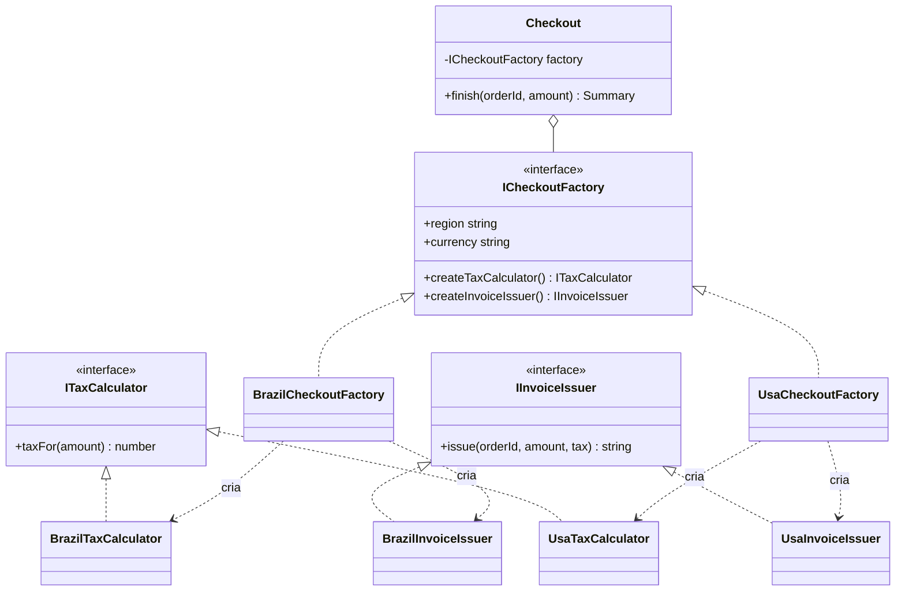

# Abstract Factory

O Abstract Factory é um padrão criacional que cria **famílias de objetos que precisam combinar entre si**. Em vez de escolher cada peça separadamente, o cliente escolhe a fábrica — e recebe o conjunto inteiro já consistente.

---

## Como funciona



O desenho tem duas metades que nunca se cruzam: as setas "cria" saindo da fábrica brasileira só chegam em classes brasileiras, e o mesmo vale do outro lado. É exatamente essa ausência de cruzamento que o padrão garante em código — não existe caminho para o `Checkout` obter um `BrazilTaxCalculator` junto de um `UsaInvoiceIssuer`.

| Parte | Responsabilidade |
|---|---|
| **Fábrica abstrata** (`ICheckoutFactory`) | Declara um método de criação por produto da família |
| **Fábricas concretas** (`BrazilCheckoutFactory`, `UsaCheckoutFactory`) | Cada uma monta a família de uma região |
| **Produtos abstratos** (`ITaxCalculator`, `IInvoiceIssuer`) | Contratos que o cliente conhece |
| **Produtos concretos** (`BrazilTaxCalculator`, `UsaInvoiceIssuer`, …) | As implementações de cada região |
| **Cliente** (`Checkout`) | Usa só as interfaces; não sabe em que região está rodando |

---

## Como usar

```typescript
import { Checkout } from './Checkout';
import { BrazilCheckoutFactory } from './BrazilCheckoutFactory';

const checkout = new Checkout(new BrazilCheckoutFactory());
checkout.finish('ord-901', 24900);
// { region: 'Brasil', currency: 'BRL', taxInCents: 4482, invoiceNumber: 'NFe-ORD-901', … }
```

Trocar para `new UsaCheckoutFactory()` muda imposto e documento fiscal de uma vez. Não existe estado em que o pedido calcule ICMS e emita invoice americana — é justamente isso que o padrão impede.

---

## Benefícios

- **Famílias sempre coerentes** — impossível misturar produtos de fábricas diferentes
- **Aberto/fechado** — uma região nova é uma fábrica nova, sem editar o `Checkout`
- **A decisão acontece uma vez** — na borda da aplicação; o resto do código nem sabe que existe região

## Malefícios

- **Muitas interfaces e classes** — cada produto da família multiplica o número de arquivos
- **Rígido para crescer** — adicionar um produto novo à família obriga a mexer na fábrica abstrata e em todas as concretas

---

## Quando usar

| Use Abstract Factory | Não use Abstract Factory |
|---|---|
| Os objetos só funcionam juntos, na combinação certa | Os objetos são independentes entre si |
| Existem variantes completas do mesmo conjunto (região, tema, fornecedor) | Existe só um objeto variando |
| Quer garantir por tipagem que ninguém mistura as famílias | A mistura é legítima e desejada |

---

## Abstract Factory x Factory Method

A [Factory Method](../factory/) cria **um** objeto e decide qual subclasse instanciar. O Abstract Factory cria **vários objetos relacionados** e garante que eles pertençam à mesma família. Na prática, uma fábrica abstrata costuma ser um punhado de factory methods dentro da mesma interface.

---

## Estrutura dos arquivos

```
creational/abstract-factory/src/
  ITaxCalculator.ts         ← produto abstrato (imposto)
  IInvoiceIssuer.ts         ← produto abstrato (documento fiscal)
  ICheckoutFactory.ts       ← fábrica abstrata
  BrazilTaxCalculator.ts    ← produto concreto (ICMS)
  BrazilInvoiceIssuer.ts    ← produto concreto (NF-e)
  BrazilCheckoutFactory.ts  ← fábrica concreta (Brasil)
  UsaTaxCalculator.ts       ← produto concreto (sales tax)
  UsaInvoiceIssuer.ts       ← produto concreto (invoice)
  UsaCheckoutFactory.ts     ← fábrica concreta (EUA)
  Checkout.ts               ← cliente (só conhece as interfaces)
  index.ts                  ← exemplo de uso (mesmo checkout em duas regiões)
  Checkout.test.ts          ← checagem de que as famílias não se misturam
```

---

## Referência

[Refactoring Guru — Abstract Factory](https://refactoring.guru/pt-br/design-patterns/abstract-factory)
