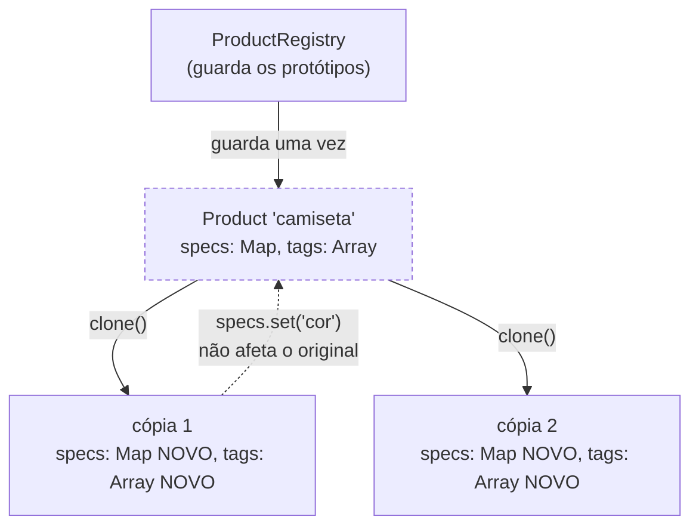

# Prototype

O Prototype é um padrão criacional que cria objetos **copiando um que já existe**, em vez de construir tudo de novo. O próprio objeto sabe se clonar, então quem pede a cópia não precisa conhecer seus campos nem sua classe concreta.

---

## Como funciona



O que o diagrama enfatiza é o "NOVO" nas cópias: `clone()` recria o `Map` e o array em vez de reaproveitar as referências do protótipo. Numa cópia rasa as três caixas apontariam para a mesma estrutura, e a seta pontilhada — a alteração feita na cópia — voltaria para o original, corrompendo todas as variações seguintes.

| Parte | Responsabilidade |
|---|---|
| **Interface** (`IPrototype<T>`) | Declara `clone`, o único método que o cliente precisa |
| **Protótipo concreto** (`Product`) | Sabe copiar a si mesmo, inclusive os campos aninhados |
| **Registro** (`ProductRegistry`) | Guarda modelos prontos e entrega cópias por chave |
| **Cliente** (`index.ts`) | Pede uma cópia e a ajusta, sem montar o objeto do zero |

---

## Como usar

```typescript
import { Product } from './Product';
import { ProductRegistry } from './ProductRegistry';

const registry = new ProductRegistry();
registry.register('camiseta', new Product({
  name: 'Camiseta básica',
  priceInCents: 7900,
  specs: new Map([['tecido', 'algodão penteado']]),
  tags: ['vestuario'],
}));

const preta = registry.spawn('camiseta');
preta.name = 'Camiseta básica preta';
preta.specs.set('cor', 'preta');   // o protótipo continua sem cor
```

O detalhe que faz o padrão funcionar é a **cópia profunda**: `clone` recria o `Map` e o array. Numa cópia rasa, o clone compartilharia essas referências e mexer nele estragaria o original.

---

## Benefícios

- **Evita montagem cara** — a configuração difícil acontece uma vez, no protótipo
- **Copia sem conhecer a classe** — o cliente depende só de `clone`
- **Substitui hierarquias de subclasses** — variações viram dados no protótipo, não classes novas

## Malefícios

- **Cópia profunda dá trabalho** — cada campo aninhado precisa ser tratado; esquecer um cria um bug silencioso
- **Referências circulares** — objetos que apontam uns para os outros complicam o clone
- **Nem sempre compensa** — se o construtor é barato, `new` é mais claro

---

## Quando usar

| Use Prototype | Não use Prototype |
|---|---|
| Montar o objeto é caro (I/O, cálculo, configuração longa) | O construtor é trivial |
| Existem muitas variações de um mesmo modelo base | Cada objeto é realmente diferente |
| O código não deve depender das classes concretas | A classe concreta já é conhecida e estável |

---

## Prototype x Builder

O [Builder](../builder/) monta um objeto complexo **passo a passo, do zero**. O Prototype parte de um objeto **já montado** e só ajusta o que muda. Builder para a primeira construção; Prototype para as variações dela.

---

## Estrutura dos arquivos

```
creational/prototype/src/
  IPrototype.ts       ← contrato (clone)
  Product.ts          ← protótipo concreto, com cópia profunda
  ProductRegistry.ts  ← registro de modelos prontos
  index.ts            ← exemplo de uso (variações de uma camiseta)
  Product.test.ts     ← checagem de que a cópia é independente
```

---

## Referência

[Refactoring Guru — Prototype](https://refactoring.guru/pt-br/design-patterns/prototype)
