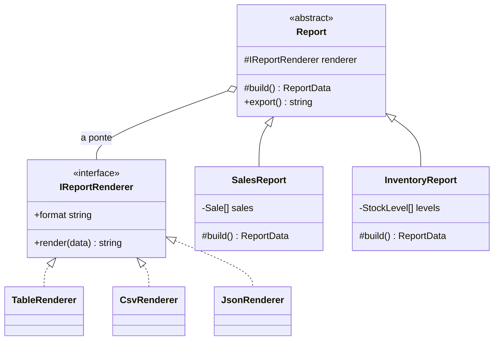

# Bridge

O Bridge é um padrão estrutural que separa **o que um objeto é** de **como ele é implementado**, em duas hierarquias que crescem sozinhas. As duas se encontram por uma referência — a ponte — em vez de por herança.

---

## Como funciona



São duas hierarquias e uma única linha ligando as duas — a ponte. À esquerda a herança cresce por *tipo de relatório*, à direita por *formato de saída*, e nenhum dos lados conhece as classes do outro. Sem essa linha, as duas dimensões se resolveriam por herança e virariam `SalesReportCsv`, `SalesReportJson`, `InventoryReportCsv`…

| Parte | Responsabilidade |
|---|---|
| **Abstração** (`Report`) | Sabe *o que* o relatório contém; delega o desenho |
| **Abstrações refinadas** (`SalesReport`, `InventoryReport`) | Montam os dados de um relatório específico |
| **Implementador** (`IReportRenderer`) | Contrato do outro eixo: transformar dados em texto |
| **Implementações** (`TableRenderer`, `CsvRenderer`, `JsonRenderer`) | Cada formato de saída, sem saber que relatório está desenhando |

Sem o Bridge, 2 relatórios × 3 formatos viram 6 classes (`SalesReportCsv`, `SalesReportJson`, …). Com ele, são 5 — e o próximo formato custa uma classe, não duas.

---

## Como usar

```typescript
import { SalesReport } from './SalesReport';
import { CsvRenderer } from './CsvRenderer';
import { TableRenderer } from './TableRenderer';

const sales = [{ month: '2025-01', orders: 128, revenueInCents: 4820000 }];

new SalesReport(new TableRenderer(), sales).export(); // tabela alinhada
new SalesReport(new CsvRenderer(), sales).export();   // mês,pedidos,receita…
```

O mesmo renderer serve para o `InventoryReport`, e o mesmo relatório serve para qualquer renderer. Os dois eixos não se conhecem.

---

## Benefícios

- **Duas dimensões sem multiplicar classes** — a combinação acontece em runtime
- **Cada lado evolui sozinho** — um formato novo não toca em nenhum relatório
- **Troca em runtime** — o formato pode vir da requisição, do usuário ou da config

## Malefícios

- **Indireção a mais** — em um código com uma dimensão só, é complexidade sem retorno
- **Precisa ser previsto cedo** — identificar os dois eixos depois, num código já acoplado, dá trabalho

---

## Quando usar

| Use Bridge | Não use Bridge |
|---|---|
| Duas dimensões variam de forma independente | Só uma coisa varia |
| A herança está explodindo em combinações | Existem duas ou três classes no total |
| Implementação precisa ser escolhida em runtime | A escolha é fixa em tempo de compilação |

---

## Bridge x Strategy

A estrutura é quase igual: um objeto guarda outro e delega. A diferença é a intenção e a escala. A [Strategy](../../behavioral/strategy/) troca **um algoritmo** dentro de um contexto; o Bridge separa **duas hierarquias inteiras** que vão crescer em paralelo. Strategy resolve uma variação; Bridge organiza uma arquitetura.

---

## Estrutura dos arquivos

```
structural/bridge/src/
  IReportRenderer.ts   ← implementador (contrato do formato de saída)
  Report.ts            ← abstração (guarda o renderer e delega)
  SalesReport.ts       ← abstração refinada (vendas por mês)
  InventoryReport.ts   ← abstração refinada (estoque atual)
  TableRenderer.ts     ← implementação (tabela alinhada)
  CsvRenderer.ts       ← implementação (csv)
  JsonRenderer.ts      ← implementação (json)
  index.ts             ← exemplo de uso (relatórios x formatos)
  Report.test.ts       ← checagem de que os dois eixos são independentes
```

---

## Referência

[Refactoring Guru — Bridge](https://refactoring.guru/pt-br/design-patterns/bridge)
