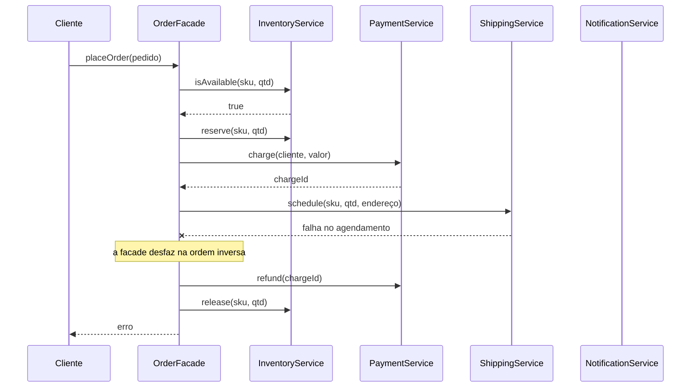

# Facade

O Facade é um padrão estrutural que fornece uma interface simples para um conjunto complexo de classes. Em vez de o cliente orquestrar vários subsistemas na ordem certa, ele faz uma única chamada e a facade cuida do resto.

---

## Como funciona



O diagrama mostra o caminho de erro de propósito: o valor da facade não está em chamar quatro serviços, e sim em saber **a ordem** e **o que desfazer** quando algo falha no meio. Esse conhecimento é justamente o que ficaria espalhado (e divergente) se cada tela chamasse os subsistemas por conta própria.

| Parte | Responsabilidade |
|---|---|
| **Facade** (`OrderFacade`) | Expõe `placeOrder` e coordena os subsistemas, inclusive o desfazer em caso de erro |
| **Subsistemas** (`InventoryService`, `PaymentService`, `ShippingService`, `NotificationService`) | Cada um cuida da sua parte, sem conhecer os outros |
| **Cliente** (`index.ts`) | Chama só a facade — não sabe quantos serviços existem nem em que ordem rodam |

---

## Como usar

```typescript
import { OrderFacade } from './OrderFacade';

const orders = new OrderFacade();

const trackingCode = orders.placeOrder({
  customerId: 'cliente-42',
  sku: 'livro-ddd',
  quantity: 1,
  amountInCents: 12900,
  address: 'Rua das Flores, 100 — São Paulo/SP',
});
```

Sem a facade, o cliente precisaria checar estoque, reservar, cobrar, agendar envio, notificar — e lembrar de estornar e liberar o estoque quando algo falhasse no meio.

---

## Benefícios

- **Simplicidade** — uma chamada no lugar de uma sequência longa e fácil de errar
- **Desacoplamento** — o cliente não depende dos subsistemas; trocar um deles não afeta quem usa a facade
- **Ordem e compensação em um lugar só** — a regra de "o que fazer quando falha" não fica espalhada

## Malefícios

- **Objeto-deus** — a facade pode virar uma classe que sabe demais e cresce sem limite
- **Menos controle** — quem precisa de um fluxo fora do padrão acaba tendo que acessar os subsistemas direto

---

## Quando usar

| Use Facade | Não use Facade |
|---|---|
| Um fluxo envolve vários serviços numa ordem específica | Existe apenas um subsistema envolvido |
| Você quer isolar o cliente de uma biblioteca ou API complexa | O cliente precisa de controle fino sobre cada passo |
| A mesma sequência se repete em vários pontos do código | A sequência é usada uma vez e é trivial |

---

## Facade x Adapter

O [Adapter](../adapter/) **traduz** uma interface incompatível em outra. O Facade **simplifica** um conjunto de interfaces que já são compatíveis — só são muitas.

---

## Estrutura dos arquivos

```
structural/facade/src/
  InventoryService.ts     ← subsistema (estoque)
  PaymentService.ts       ← subsistema (pagamento)
  ShippingService.ts      ← subsistema (envio)
  NotificationService.ts  ← subsistema (notificação)
  OrderFacade.ts          ← facade (coordena tudo)
  index.ts                ← exemplo de uso (pedido com e sem estoque)
  OrderFacade.test.ts     ← checagem do desfazer quando o pagamento falha
```

---

## Referência

[Refactoring Guru — Facade](https://refactoring.guru/pt-br/design-patterns/facade)
