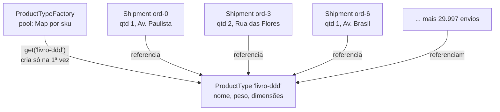

# Flyweight

O Flyweight é um padrão estrutural que faz **milhares de objetos caberem na memória** compartilhando o que eles têm em comum. O estado repetido vira um objeto só; o que varia fica de fora e chega por parâmetro.

---

## Como funciona



Todas as setas convergem para uma caixa só: os 30 mil envios não têm cópia nenhuma de nome, peso ou dimensões — eles apontam para o mesmo `ProductType`. Cada `Shipment` guarda apenas o que muda de fato (pedido, quantidade, endereço). É também por isso que o flyweight precisa ser imutável: alterá-lo mudaria os 30 mil de uma vez.

| Parte | Responsabilidade |
|---|---|
| **Flyweight** (`ProductType`) | Guarda só o estado intrínseco, imutável e compartilhado |
| **Fábrica** (`ProductTypeFactory`) | Devolve a instância existente; só cria quando não há |
| **Contexto** (`Shipment`) | Guarda o estado extrínseco e aponta para o flyweight |
| **Cliente** (`index.ts`) | Pede tudo à fábrica, nunca usa `new ProductType` |

A divisão do estado é a decisão central do padrão:

| Intrínseco (compartilhado) | Extrínseco (por contexto) |
|---|---|
| nome, peso, dimensões do produto | pedido, quantidade, endereço de entrega |
| igual em todo envio daquele sku | diferente a cada envio |

---

## Como usar

```typescript
import { ProductTypeFactory } from './ProductTypeFactory';
import { Shipment } from './Shipment';

const factory = new ProductTypeFactory();

for (let i = 0; i < 30000; i += 1) {
  const type = factory.get('livro-ddd', 'Domain-Driven Design', 900, '23x16x4cm');
  shipments.push(new Shipment(type, `ord-${i}`, 1, 'Av. Paulista, 1000'));
}

factory.size; // 3 — não 30.000
```

---

## Benefícios

- **Memória** — o estado repetido existe uma vez, não uma vez por objeto
- **Transparente para o cliente** — ele pede à fábrica e usa normalmente
- **Comparação barata** — dois contextos do mesmo tipo apontam para a mesma instância

## Malefícios

- **Complexidade real** — separar intrínseco de extrínseco polui a assinatura dos métodos
- **Troca CPU por memória** — o estado extrínseco pode acabar sendo recalculado ou repassado o tempo todo
- **Mutação é proibida** — alterar um flyweight afeta todos os contextos de uma vez; ele precisa ser imutável
- **Otimização prematura** — com centenas de objetos, não compensa

---

## Quando usar

| Use Flyweight | Não use Flyweight |
|---|---|
| Existem muitos objetos e a memória é um problema medido | O número de objetos é pequeno |
| Boa parte do estado se repete entre eles | Cada objeto é realmente único |
| O estado repetido pode ser imutável | O objeto precisa mudar por contexto |

---

## Flyweight x Singleton

O [Singleton](../../creational/singleton/) garante **uma instância para a aplicação inteira**. O Flyweight tem **uma instância por valor compartilhado** — três skus, três flyweights — e nada impede criar outra fábrica com outro pool. Singleton é sobre acesso global; Flyweight é sobre memória.

---

## Estrutura dos arquivos

```
structural/flyweight/src/
  ProductType.ts              ← flyweight (estado intrínseco, imutável)
  ProductTypeFactory.ts       ← pool que garante o compartilhamento
  Shipment.ts                 ← contexto (estado extrínseco)
  index.ts                    ← exemplo de uso (30 mil envios, 3 fichas)
  ProductTypeFactory.test.ts  ← checagem de identidade e do tamanho do pool
```

---

## Referência

[Refactoring Guru — Flyweight](https://refactoring.guru/pt-br/design-patterns/flyweight)
